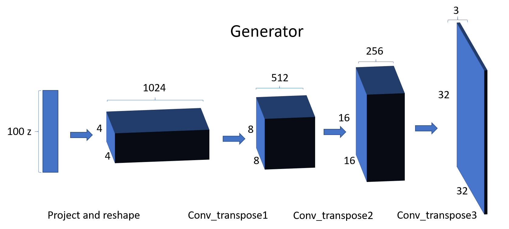
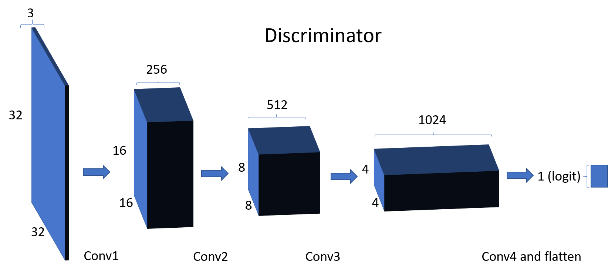
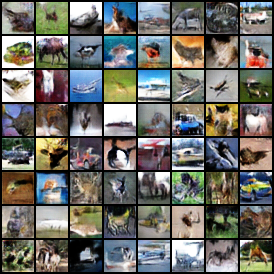
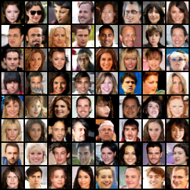
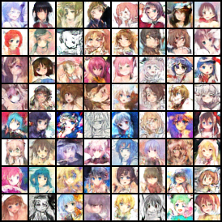

# General Purpose Image Generator by WGAN
Autohrs: Jingyuan Chen, Tenghao Huang, Jiyao Wang, Haidong Yi

## Abstract
In this project, we reproduced the implementation of Wasserstein Generative Adversarial Network (WGAN) and trained it on several datasets for image generation purpose. The datasets include multi-class natural photos, human face images, and animation character images. Results are measured by Frechet Inception Distance (FID).
## Introduction
Image generation is always a field of interest in machine learning. The Generative Adversarial Network (GAN) is proved to be an effective model in generating plausible fake images from training sets. Related work concerning this subject has introduced several variations of this model including DCGAN, CycleGAN, and WGAN. Our project aims at examining the power of WGAN in image generation, especially its application in generating human designed images.
## Methods
A Generative Adversarial Network (GAN) is a deep learning generative model including a discriminator and a generator. The generator G tries to generate fake images to fool the discriminator while the discriminator D tries to classify fake and real images.  
 
In our implementation, the generator has a total of 4 deconvolutional layers implemented with transpose convolution, each has a filter size of 4 and stride of 2 except for the first. We added batch norm and ReLU layers after each layer except the last. The discriminator has a total of 4 convolutional layers, and we added instance norm and leaky ReLU layers after each except for the last. We use no fully connected layers and skip the log operation on the output. Below is the illustration of our network structure:

## Results
We used Frechet Inception Distance score (FID) as our metric for the ability of the network. The FID is a measure that compares the feature vectors between two set of images. In its application to measure the performance of image generator, it is usually used to measure the distance between real and fake images. It is proposed as a replacement of inception score, which fails in capturing how synthetic images compare to real images.   
We used inception-v3 model to calculate FID. The activations act as a multivariate Gaussian by calculating the mean and covariance of images. The statistics over real and fake image sets are later calculated. Generally speaking, lower score between two image sets indicate that the two groups are more similar. A 0.0 inception score indicates that the two image groups are statistically identical.  
We experimented the network on three datasets: Cifar10, CelebA and the animation dataset. We gained an FID of 222.814 on Cifar10, 113.095 on celebA and 297.084 on the animation character dataset. Below are samples of each dataset generated by our model after being trained for 40000 iterations:   
   
## Dependencies 
* numpy
* pytorch (>=1.3)
* torchvision
* tqdm
* pyyaml
* tensorboardX

## Usage

## Reference
This repo partially referenced the implementation of W-GAN in this [repo](https://github.com/Zeleni9/pytorch-wgan).

Arjovsky, Martin, Soumith Chintala, and Léon Bottou. "Wasserstein generative adversarial networks." International conference on machine learning. 2017.

Gulrajani, Ishaan, et al. "Improved training of wasserstein gans." Advances in neural information processing systems. 2017.
